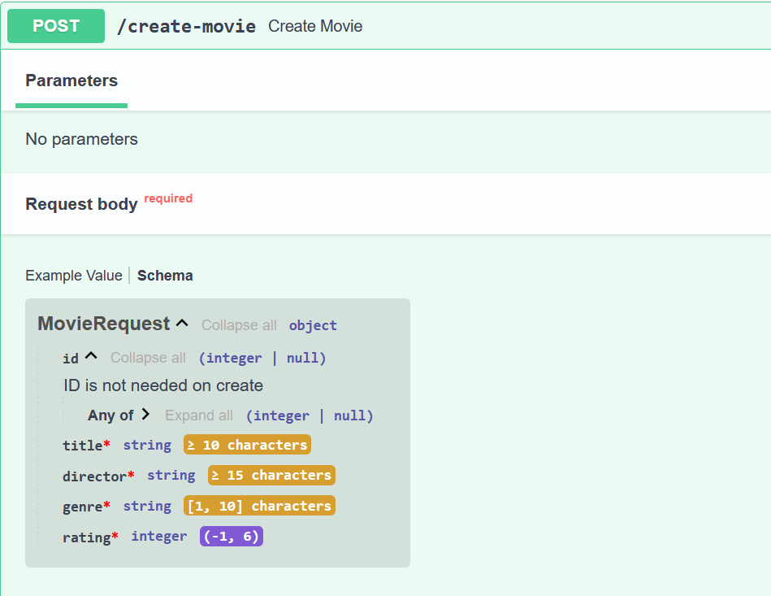
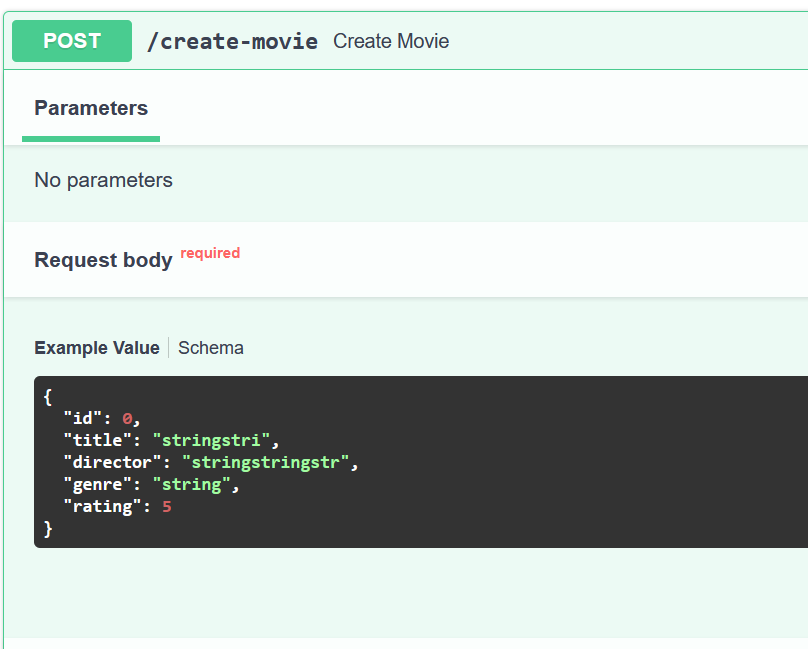

## Pydantics Configuration

We will see a couple of configurations for swagger ui.

#### 1. Adding a description for optional model attributes

- `id` is an optional model attribute and we have defined that as well. But if we want to know which attribute is optional to which request in the swagger ui, you can update `id` attribute in the MovieRequest model as follows:

```python
    id: Optional[int] = Field(description="ID is not needed on create", default=None)
```



#### 2. Changing example values

Our current example value in swagger ui looks like this:



If we want to change them to our custom values which are related to the attributes, we can add model_config in the MovieRequest model as follows:

```python
model_config = {
    "json_schema_extra":{
        "example": {
            "title": "A new movie",
            "director": "A movie director",
            "genre" : "Comedy",
            "rating": 5
        }
    }
}
```

Now, our default example values will be changed.
