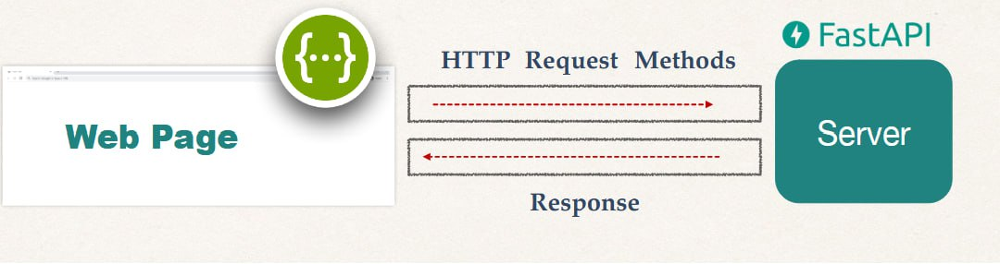

## Movies Project

This is the first project we are going to create using fastAPI. We are going to learn all the basic HTTP request methods using fastAPI.

### What will we be creating?

- We will create and enhance movies to learn the basics of FastAPI.

```python
MOVIES = [
    {"title": "Inception", "director": "Christopher Nolan", "genre": "Sci-Fi"},
    {"title": "The Godfather", "director": "Francis Ford Coppola", "genre": "Crime"},
    {"title": "Spirited Away", "director": "Hayao Miyazaki", "genre": "Animation"},
    {"title": "Parasite", "director": "Bong Joon-ho", "genre": "Thriller"},
    {"title": "Pulp Fiction", "director": "Quentin Tarantino", "genre": "Drama"},
]

```

> We have a list of movies and these movies have a key-value pair.

We are going to use the _CRUD_ operations. _CRUD_ stands for `Create`, `Read`, `Update` and `Delete`. Therefore, we are going to create new movies that are going to be added to this list, get and read all the movies, update specific movie and delete books from the list.



### HTTP Request Methods

HTTP request methods have their own verbs attached to the CRUD operation that we need to use within our application.

| **CRUD Operation** | **HTTP Method** |
| ------------------ | --------------- |
| **Create**         | `POST`          |
| **Read**           | `GET`           |
| **Update**         | `PUT`           |
| **Delete**         | `DELETE`        |
